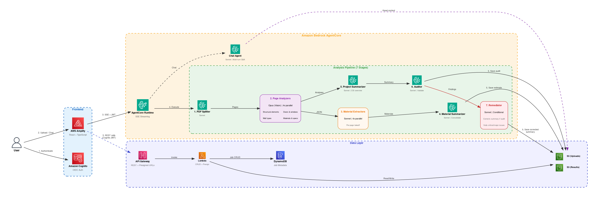

# Guidance for Generating a Bill of Materials from Blueprints on AWS

## Table of Contents

1. [Overview](#overview)
    - [Cost](#cost)
2. [Prerequisites](#prerequisites)
    - [Operating System](#operating-system)
    - [Third-party tools](#third-party-tools)
    - [AWS account requirements](#aws-account-requirements)
    - [AWS CDK bootstrap](#aws-cdk-bootstrap)
    - [Supported Regions](#supported-regions)
3. [Deployment Steps](#deployment-steps)
4. [Deployment Validation](#deployment-validation)
5. [Running the Guidance](#running-the-guidance)
6. [Next Steps](#next-steps)
7. [Cleanup](#cleanup)
8. [FAQ, known issues, additional considerations, and limitations](#faq-known-issues-additional-considerations-and-limitations)
9. [Notices](#notices)
10. [Authors](#authors)

## Overview

This Guidance demonstrates how to build an AI-powered construction blueprint analysis pipeline that extracts material takeoffs, door and window schedules, wall assemblies, and project summaries from architectural PDF drawings. It uses **Amazon Bedrock** with Claude vision capabilities to read blueprint pages and produce structured, deterministic JSON output alongside human-readable markdown.

Construction professionals today spend hours manually reviewing multi-page blueprint sets to extract material quantities, verify schedules, and produce cost estimates. This Guidance automates that process using a multi-agent pipeline that analyzes each page in parallel, consolidates materials across pages, audits the results for accuracy, and self-corrects when issues are found.

### Architecture



1. A user uploads a construction blueprint PDF through the **React** frontend hosted on **AWS Amplify**.
2. The frontend authenticates the user via **Amazon Cognito** and sends the PDF to **Amazon S3** using a presigned URL generated by **Amazon API Gateway** and **AWS Lambda**.
3. The frontend invokes the **Amazon Bedrock AgentCore** Runtime, which runs the multi-agent analysis pipeline.
4. The PDF Splitter agent renders each page to a PNG image using **Claude Sonnet**.
5. Page Analyzer agents use **Claude Opus** (vision) to extract structural elements, doors, windows, walls, materials, dimensions, and reference standards from each page in parallel.
6. Material Extractor agents produce per-page material takeoffs from the page analyses.
7. The Material Summarizer agent consolidates quantities across all pages, deduplicates entries, and flags conflicts.
8. The Project Summarizer agent synthesizes all pages into a CSI-organized project overview.
9. The Auditor agent cross-references individual page analyses against the project summary and produces severity-rated findings.
10. If critical or major issues are found, the Remediator agent regenerates the project summary from scratch to address all audit findings.
11. All results are stored in **Amazon S3** (JSON and markdown) with job metadata tracked in **Amazon DynamoDB**.

### Cost

_You are responsible for the cost of the AWS services used while running this Guidance. As of May 2026, the cost for running this Guidance with the default settings in the US East (N. Virginia) Region is approximately $77.37 per month for processing 30 blueprint analyses._

The primary cost driver is Amazon Bedrock model invocations. Each blueprint analysis invokes Claude Opus (vision) for page analysis and Claude Sonnet for text processing stages. A typical 6-page blueprint requires approximately 4-6 Opus calls and 10-15 Sonnet calls.

_We recommend creating a [Budget](https://docs.aws.amazon.com/cost-management/latest/userguide/budgets-managing-costs.html) through [AWS Cost Explorer](https://aws.amazon.com/aws-cost-management/aws-cost-explorer/) to help manage costs. Prices are subject to change. For full details, refer to the pricing webpage for each AWS service used in this Guidance._

### Sample Cost Table

The following table provides a sample cost breakdown for deploying this Guidance with the default parameters in the US East (N. Virginia) Region for one month, assuming 30 blueprint analyses of 6-page documents.

| AWS service | Dimensions | Cost [USD] |
| ----------- | ---------- | ---------- |
| Amazon Bedrock (Claude Opus) | ~150 vision calls, ~500K input tokens, ~200K output tokens | $ 45.00 |
| Amazon Bedrock (Claude Sonnet) | ~450 text calls, ~2M input tokens, ~500K output tokens | $ 22.00 |
| Amazon Bedrock AgentCore Runtime | 1 runtime instance, on-demand | $ 8.00 |
| Amazon S3 | 5 GB storage, 10,000 requests | $ 0.15 |
| Amazon DynamoDB | 1 GB storage, 10,000 read/write units | $ 1.25 |
| Amazon Cognito | 50 active users | $ 0.00 |
| Amazon API Gateway | 5,000 REST API calls | $ 0.02 |
| AWS Lambda | 5,000 invocations, 256MB, 3s avg duration | $ 0.10 |
| AWS Amplify Hosting | 1 app, 5 GB served | $ 0.85 |
| **Total** | | **$ 77.37** |

## Prerequisites

### Operating System

These deployment instructions are optimized to best work on **Amazon Linux 2023**. Deployment on macOS or Windows (WSL) is also supported via the automated deploy script.

### Third-party tools

| Tool | Version | Install Command |
| ---- | ------- | --------------- |
| AWS CLI | 2.x | [Install guide](https://docs.aws.amazon.com/cli/latest/userguide/getting-started-install.html) |
| Node.js | 20+ | [Install guide](https://nodejs.org/) |
| npm | 10+ | Included with Node.js |
| Python | 3.11+ | [Install guide](https://www.python.org/downloads/) |
| Docker | 24+ | [Install guide](https://docs.docker.com/engine/install/) |
| AWS CDK CLI | 2.x | `npm install -g aws-cdk` |

### AWS account requirements

- AWS account with permissions to create: S3 buckets, CloudFront distributions, Cognito User Pools, Amplify Hosting projects, Bedrock AgentCore resources, API Gateway, Lambda functions, DynamoDB tables, IAM roles and policies, ECR repositories
- Amazon Bedrock model access enabled for:
  - `anthropic.claude-opus-4-6-v1` (Claude Opus — used for vision/page analysis)
  - `anthropic.claude-sonnet-4-20250514-v1:0` (Claude Sonnet — used for text stages and chat)
- Docker daemon running (required for building the AgentCore container image)

### AWS CDK bootstrap

This Guidance uses AWS CDK. If you are using AWS CDK for the first time in your account and Region, perform the following bootstrapping:

```bash
npm install -g aws-cdk
cdk bootstrap aws://ACCOUNT_ID/REGION
```

Replace `ACCOUNT_ID` with your AWS account ID and `REGION` with your target deployment Region.

### Supported Regions

This Guidance can be deployed in any AWS Region that supports Amazon Bedrock with Claude Opus and Sonnet models, Amazon Bedrock AgentCore, and AWS Amplify Hosting. Recommended Regions:

- US East (N. Virginia) — `us-east-1`
- US West (Oregon) — `us-west-2`

## Deployment Steps

1. Clone the repository:
   ```bash
   git clone https://github.com/aws-solutions-library-samples/guidance-for-generating-a-bill-of-material-from-blueprints-on-aws.git
   cd guidance-for-generating-a-bill-of-material-from-blueprints-on-aws/source
   ```

2. Verify Docker is running:
   ```bash
   docker info
   ```

3. Configure the deployment by editing `infra-cdk/config.yaml`:
   ```yaml
   stack_name_base: BlueprintAnalyzer
   admin_user_email: your-email@example.com  # Optional: auto-creates admin user
   backend:
     pattern: blueprint-analyzer
     deployment_type: docker
     network_mode: PUBLIC
   ```

4. Install CDK project dependencies:
   ```bash
   cd infra-cdk
   npm install
   ```

5. Bootstrap CDK (first time only per account/Region):
   ```bash
   cdk bootstrap aws://$(aws sts get-caller-identity --query Account --output text)/$(aws configure get region)
   ```

6. Deploy the backend stack:
   ```bash
   cdk deploy --all --require-approval never
   ```
   This creates the Cognito User Pool, builds and pushes the agent container to ECR, creates the AgentCore Runtime, sets up API Gateway with Lambda handlers, creates the S3 bucket and DynamoDB table, and configures Amplify Hosting. Deployment takes approximately 5-10 minutes.

7. Deploy the frontend:
   ```bash
   cd ..
   python3 scripts/deploy-frontend.py
   ```
   This generates `aws-exports.json` from CDK stack outputs, builds the React application, and deploys it to AWS Amplify. The script outputs the application URL upon completion.

8. Create a Cognito user (if you did not set `admin_user_email` in config.yaml):
   ```bash
   aws cognito-idp admin-create-user \
     --user-pool-id $(aws cloudformation describe-stacks --stack-name BlueprintAnalyzer --query "Stacks[0].Outputs[?OutputKey=='CognitoUserPoolId'].OutputValue" --output text) \
     --username your-email@example.com \
     --user-attributes Name=email,Value=your-email@example.com Name=email_verified,Value=true \
     --temporary-password TempPass123!
   ```

9. Capture the application URL:
   ```bash
   aws cloudformation describe-stacks --stack-name BlueprintAnalyzer \
     --query "Stacks[0].Outputs[?OutputKey=='AmplifyUrl'].OutputValue" --output text
   ```

## Deployment Validation

1. Verify the CloudFormation stack deployed successfully:
   ```bash
   aws cloudformation describe-stacks --stack-name BlueprintAnalyzer \
     --query "Stacks[0].StackStatus" --output text
   ```
   Expected output: `CREATE_COMPLETE` or `UPDATE_COMPLETE`

2. Verify the AgentCore Runtime is active:
   ```bash
   aws cloudformation describe-stacks --stack-name BlueprintAnalyzer \
     --query "Stacks[0].Outputs[?OutputKey=='RuntimeArn'].OutputValue" --output text
   ```
   Expected output: An ARN in the format `arn:aws:bedrock:REGION:ACCOUNT:agent-runtime/...`

3. Verify the Amplify app is deployed by opening the application URL in your browser. You should see the Blueprint Analyzer sign-in page.

4. Verify the S3 bucket exists:
   ```bash
   aws s3 ls | grep blueprint
   ```

## Running the Guidance

### Inputs

- A construction blueprint PDF file (architectural drawings, floor plans, elevations, sections, or schedules)

### Steps

1. Open the application URL in your browser and sign in with your Cognito credentials. Change your temporary password on first login.

2. On the dashboard, click the upload area or drag and drop a blueprint PDF file.

3. The analysis pipeline starts automatically. Monitor real-time progress as each stage completes:
   - Stage 1: PDF splitting into page images
   - Stage 2: Vision analysis of each page (parallel)
   - Stage 3: Material extraction per page (parallel)
   - Stage 4: Material consolidation
   - Stage 5: Project summary generation
   - Stage 6: Audit and cross-referencing
   - Stage 7-8: Remediation (if needed)

4. Once complete, click "View Results" to explore the analysis:
   - **Pages tab** — Side-by-side view of the blueprint image and extracted structured data for each page
   - **Project Summary tab** — CSI-organized overview with drawing index, material divisions, wall types, and specifications
   - **Material Estimate tab** — Consolidated door schedule, window schedule, wall summary, and material totals with conflict warnings
   - **Audit Report tab** — Severity-rated findings with completeness score

5. Use the **Chat** button to ask follow-up questions about the blueprint analysis. The chat agent has full context of all extracted data and can reference specific pages.

### Expected Output

Each analysis produces structured JSON and markdown files stored in S3:
- Per-page analysis (structural elements, doors, windows, walls, materials, dimensions, standards)
- Consolidated material estimate (door/window schedules, wall summary, material totals)
- Project summary (CSI divisions, drawing index, specifications, quantities)
- Audit report (findings with severity levels, completeness percentage)

## Next Steps

- **Match materials to product catalog:** Extend the pipeline with an additional agent that maps extracted materials to a product inventory database, generating purchase orders or shopping lists.
- **Custom output formats:** Modify the structured output tools in `source/patterns/blueprint-analyzer/blueprint_analyzer/tools/structured_tools.py` to produce additional formats (CSV, Excel, IFC).
- **Batch processing:** Add a queue-based workflow using Amazon SQS to process multiple blueprints concurrently.
- **Fine-tune prompts:** Adjust agent prompts in `source/patterns/blueprint-analyzer/blueprint_analyzer/agents.py` for specific blueprint types (mechanical, electrical, plumbing).
- **Add authentication providers:** Replace or augment Cognito with your existing identity provider using the OIDC configuration in `source/frontend/src/hooks/useAuth.ts`.

## Cleanup

To remove all deployed resources:

1. Delete all objects from the S3 bucket (required before stack deletion):
   ```bash
   BUCKET_NAME=$(aws cloudformation describe-stacks --stack-name BlueprintAnalyzer \
     --query "Stacks[0].Outputs[?contains(OutputKey,'Bucket')].OutputValue" --output text | head -1)
   aws s3 rm "s3://$BUCKET_NAME" --recursive
   ```

2. Destroy the CDK stack:
   ```bash
   cd source/infra-cdk
   cdk destroy --all --force
   ```

3. (Optional) Remove the CDK bootstrap stack if no longer needed:
   ```bash
   aws cloudformation delete-stack --stack-name CDKToolkit
   ```

## FAQ, known issues, additional considerations, and limitations

**Known issues:**

- Blueprint PDFs with very low resolution or hand-drawn elements may produce less accurate extractions.
- Pages exceeding ~3.8MB raw image size are automatically downscaled before sending to the vision model, which may reduce detail extraction.
- The pipeline currently supports English-language blueprints only.

**Additional considerations:**

- This Guidance invokes Amazon Bedrock foundation models (Claude Opus and Sonnet). Costs scale with the number of pages analyzed and the complexity of each page.
- Each page analysis runs in a separate agent session to avoid context window overflow. A 20-page blueprint creates 20 parallel Opus vision calls.
- The AgentCore Runtime runs as a Docker container. Ensure your account has sufficient ECR storage and Bedrock concurrency limits.
- All uploaded PDFs and analysis results are stored in a private S3 bucket scoped to the authenticated user. Job deletion removes all associated S3 objects.
- This Guidance uses PyMuPDF (AGPL-3.0 licensed) for PDF rendering. Commercial deployments may require an Artifex Commercial License or replacement with an alternative library.

**Limitations:**

- Amazon Bedrock AgentCore is required and may not be available in all Regions.
- The automated validation environment does not support multi-account deployments.
- Maximum recommended PDF size is 50 pages. Larger documents may exceed timeout limits.

For any feedback, questions, or suggestions, please use the [Issues tab](https://github.com/aws-solutions-library-samples/guidance-for-generating-a-bill-of-material-from-blueprints-on-aws/issues) under this repo.

## Notices

*Customers are responsible for making their own independent assessment of the information in this Guidance. This Guidance: (a) is for informational purposes only, (b) represents AWS current product offerings and practices, which are subject to change without notice, and (c) does not create any commitments or assurances from AWS and its affiliates, suppliers or licensors. AWS products or services are provided "as is" without warranties, representations, or conditions of any kind, whether express or implied. AWS responsibilities and liabilities to its customers are controlled by AWS agreements, and this Guidance is not part of, nor does it modify, any agreement between AWS and its customers.*

## Authors

- David Christian (Principal Solutions Architect, AWS Industries — Retail/CPG)
- Daman Orestad (Guidance Solutions Architect, AWS Industries — Retail/CPG)
- Saurav Bandi (Solutions Architect, HQ-AWS In-Tech&Innovation-AWSI)
